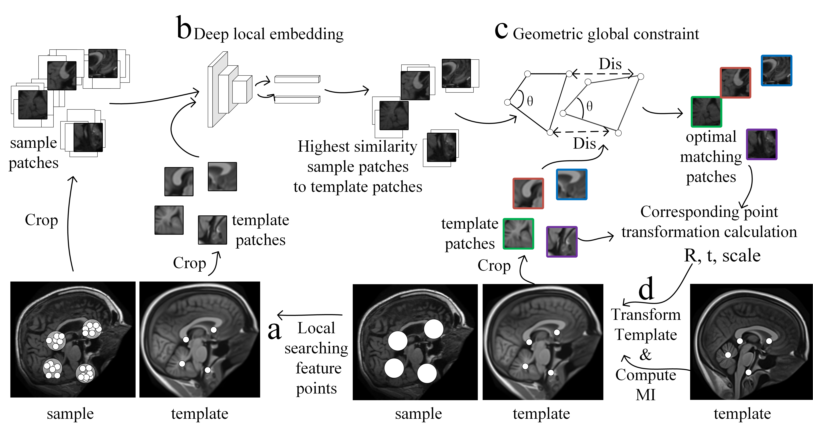
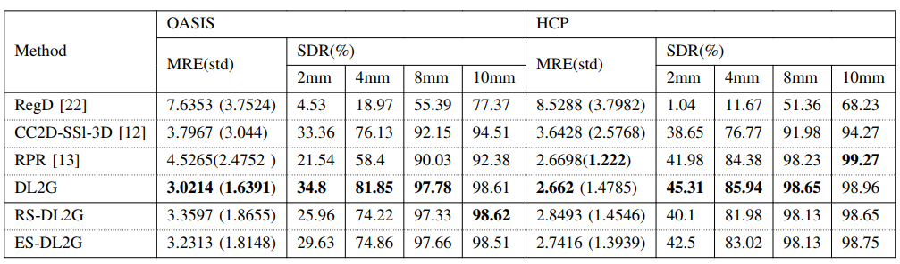

# DL2G: Anatomical Landmark Detection with Deep Local Features and Geometric Global Constraint (BIBM 2024)

This repository provides an overview of the **DL2G** framework, a novel method for anatomical landmark detection in medical images, particularly 3D MRI, combining deep local features with global geometric constraints.

**Paper:** DL2G: Anatomical Landmark Detection with Deep Local Features and Geometric Global Constraint

**Authors:** Rui Wang, Wanli Yang, Kuntao Xiao, Yi Sun, Shurong Sheng, Zhao Lv, Jiahong Gao

**Conference:** 2024 IEEE International Conference on Bioinformatics and Biomedicine (BIBM)

**DOI:** 10.1109/BIBM62325.2024.10822870

  
*Figure 1: DL2G framework workflow. (a) Feature point detection and filtering. (b) Deep feature embedding and candidate selection. (c) Geometric consistency optimization. (d) Iterative refinement.*
## Abstract

Anatomical landmark detection is crucial for many medical image analysis tasks like surgical navigation and image registration. Traditional methods often lack robustness, while current supervised deep learning approaches can be uninterpretable regarding global information usage and face GPU memory limitations with large 3D datasets. Furthermore, existing methods often neglect intrinsic geometric cues. This paper introduces **DL2G**, a novel framework that integrates deep learning's representation capabilities with global geometric information from images and point sets. DL2G performs landmark localization in a local-to-global fashion:
1.  A deep feature descriptor, trained via self-supervised contrastive learning, screens candidate points by comparing local patch embeddings.
2.  Geometric constraints derived from labeled template point sets select geometrically consistent matching point sets.
3.  Iterative optimization using global mutual information of images refines landmark localization.

Evaluated on public MRI head datasets (OASIS, HCP) for detecting 32 anatomical landmarks (AFID protocol), DL2G demonstrates superior accuracy and computational efficiency compared to state-of-the-art methods.

## Problem Addressed

*   **Limitations of Traditional Methods:** Poor generalization and robustness, sensitivity to image variations.
*   **Limitations of Supervised DL:** Lack of interpretability for global context, high annotation dependency, GPU memory constraints for 3D data.
*   **Oversight in Existing Methods:** Neglecting crucial global geometric structures of images and landmarks.
*   **Scarcity of Methods for High-Res 3D:** Limited research specifically addressing high-resolution 3D medical images.

## Key Features & Contributions

*   **Hybrid Approach:** Combines the power of deep local features with explicit global geometric constraints.
*   **Local Feature Descriptor:**
    *   Trained using self-supervised **contrastive learning** (MoCo-based) on informative feature points.
    *   Employs **multiple augmentations** simultaneously (rotation, scaling, masking) to enhance robustness.
    *   Introduces **local suppression training** to mitigate false negatives based on spatial proximity.
*   **Efficient Feature Point Selection:** Uses a **spatial combination decision method** (inspired by Saddle) to identify high-information-density points, reducing data volume significantly (~80x voxel reduction mentioned).
*   **Geometric Consistency Constraint:**
    *   Leverages **distance consistency** (scale estimation, quaternion-based alignment) and **direction consistency** (outlier detection based on angles, weighted error minimization) between template and candidate landmark sets.
    *   Utilizes **iterative optimization** guided by image **mutual information** maximization for final refinement.
*   **Local-to-Global Strategy:** Progressively narrows down landmark possibilities from local patch similarity to globally consistent geometric configurations.
*   **State-of-the-Art Performance:** Achieves superior Mean Radial Error (MRE) and Success Detection Rate (SDR) on OASIS and HCP datasets compared to RegD (ANTs), CC2D-SSL-3D, and RPR methods.

## Methodology Overview


DL2G employs a multi-stage pipeline to accurately and efficiently detect anatomical landmarks in a target medical image:

1.  **Feature Point Detection:**
    *   Reduces computational load by identifying a sparse set of points (`P`) with high information density within the 3D sample image (`Is`) using *spatial combination patterns* (inspired by Saddle [14]). This avoids processing empty/redundant voxels.
    *   Significantly reduces the number of points considered compared to dense voxel grids or random sampling.

2.  **Local Patch Descriptor (Learned via Contrastive Learning):**
    *   **Training:** A deep neural network (e.g., 3D ResNet10) is trained as a feature descriptor using self-supervised contrastive learning (based on MoCo [15]) on local image patches centered around detected feature points.
    *   **Enhancements:** Uses *multi-augmentation* (rotation, scaling, masking) and proposed *local suppression training* to mitigate false negatives based on spatial proximity in the normalized image space.
    *   **Inference:** This pre-trained model extracts descriptive embedding vectors for local patches around:
        *   Known template landmarks (`L`) in the template image (`It`).
        *   Candidate feature points (`P'`) in the sample image (`Is`).

3.  **Candidate Point Selection (Local Matching):**
    *   Feature points (`P`) in the sample image are filtered and augmented based on proximity to template landmarks (`L`) -> `P'`.
    *   For each target landmark `l_i` in `L`, an initial set of candidate points (`C_i·`) in the sample image is identified by finding points in `P'` whose local patch embeddings have the highest *cosine similarity* to the embedding of `l_i`. All candidates form the set `C`.

4.  **Geometric Consistency & Iterative Optimization (Global Refinement):**
    *   Refines the initial candidate correspondences (`F`, initialized from `C`) using global geometric information in an iterative process:
        *   **Initialization:** Select an initial corresponding point set `F` from `C`.
        *   **Iterative Loop:**
            *   **(a) Distance Consistency:** Enforces similarity in point-to-point distances between template landmarks (`L`) and the current estimated landmarks (`F`). Computes scale (`s1`) and rigid transformation (rotation `R1`, translation `t1`) to align `L` with `F`. Updates `F` to `F'` by selecting the closest points from `C` to the transformed template landmarks (`L'`).
            *   **(b) Direction Consistency:** Enforces similarity in the orientation of vectors connecting pairs of points. Identifies and replaces direction outliers in `F'` based on a weighted error combining distance and direction consistency errors. This yields refined landmarks `F''` and a refined transformation (`R2`, `t2`, `s2`) leading to `L''`.
            *   **(c) Template Transformation & Evaluation:** Combines the transformations (`R2*R1`, `t1+t2`, `s1*s2`) into a final affine matrix `A_FL`. Applies `A_FL` to the *template image* (`It`). Calculates the *Mutual Information (MI)* between the transformed template (`A_FL ◦ It`) and the sample image (`Is`).
            *   **(d) Termination Check:** If MI increased compared to the previous iteration, update `F = F''` and repeat the loop from step (a). If MI decreased or converged, stop the iteration.
    *   **Output:** The landmark set `F` from the iteration *before* the MI decreased is returned as the final detected landmarks.
*(Refer to Algorithm 1 and Figure 2 in the paper for details)*

## Datasets & Evaluation

*   **Datasets:** OASIS [19], HCP [20] (publicly available 3D T1w brain MRI).
*   **Annotation:** AFID protocol [21] for 32 anatomical landmarks.
*   **Preprocessing:** Resized to 256x256x256, 1mm isotropic, RAS+ orientation, center of mass alignment, intensity normalization (0-255).
*   **Evaluation Metrics:** Mean Radial Error (MRE), Standard Deviation (std), Success Detection Rate (SDR) @ {2mm, 4mm, 8mm, 10mm}.
*   **Baselines:** Registration (ANTs affine) [22], CC2D-SSL-3D [12], RPR [13].

## Results Summary
DL2G was rigorously evaluated on the public OASIS and HCP brain MRI datasets against contemporary methods using the AFID protocol for 32 anatomical landmarks.

Performance Comparison (MRE in mm, SDR %)


Visualization

Figure 4 in the paper provides a compelling visual walkthrough of the DL2G detection process for sample images from OASIS and HCP datasets, illustrating the progression from initial feature points to the finally detected landmarks refined by geometric consistency.

## Acknowledgements

This work utilized publicly available datasets. We gratefully acknowledge the providers of:
OASIS Dataset: Open Access Series of Imaging Studies (Marcus et al., 2007, J Cogn Neurosci). [Ref [19] in paper]
HCP Dataset: Human Connectome Project, WU-Minn Consortium (Principal Investigators: David Van Essen and Kamil Ugurbil; Fan et al., 2016, NeuroImage). [Ref [20] in paper]
AFID Annotations: The anatomical fiducial annotations used for evaluation were based on the AFID protocol (Taha et al., 2023, Scientific Data). [Ref [21] in paper]

We thank the researchers and institutions responsible for creating and sharing these valuable resources.
## Citation

If you find this work useful, please cite the original paper:
```
@INPROCEEDINGS{10822870,
  author={Wang, Rui and Yang, Wanli and Xiao, Kuntao and Sun, Yi and Sheng, Shurong and Lv, Zhao and Gao, Jiahong},
  booktitle={2024 IEEE International Conference on Bioinformatics and Biomedicine (BIBM)}, 
  title={DL2G: Anatomical Landmark Detection with Deep Local Features and Geometric Global Constraint}, 
  year={2024},
  volume={},
  number={},
  pages={1695-1700},
  keywords={Location awareness;Three-dimensional displays;Protocols;Navigation;Memory management;Surgery;Feature extraction;Robustness;Optimization;Mutual information;Landmark detection;Deep feature descriptor;Geometric constraint;Contrastive learning},
  doi={10.1109/BIBM62325.2024.10822870}}
```

## License


The conference paper describing DL2G is copyrighted by IEEE (©2024 IEEE).

The source code for this project has not been publicly released alongside this paper overview. Therefore, no open-source license currently applies to the implementation. All rights to the code implementation are reserved by the authors and their affiliated institutions. Please contact the corresponding authors (kjlz@ahu.edu.cn, jgao@pku.edu.cn) if you are interested in the code or potential collaborations.
